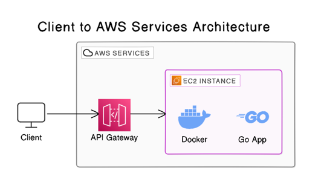

# meli-quasar-fire
Un Repositorio de la Alianza Rebelde 🧑🏻‍🚀🛰️

## Descripción General

Este proyecto implementa una solución basada en los principios de Arquitectura Limpia en Go. Proporciona un servicio RESTful para determinar la posición y el mensaje de una nave utilizando datos de satélites.

### Características Principales
- **Posicionamiento por Satélite**: Calcula la posición de la fuente oculta utilizando trilateración.
- **Reconstrucción de Mensajes**: Reconstruye el mensaje original a partir de transmisiones parciales.
- **Almacenamiento Individual por Satélite**: Permite almacenar y procesar mensajes de cada satélite de forma individual.
- **Eliminación de Mensajes Almacenados**: Proporciona la capacidad de eliminar los datos almacenados de los satélites.


### Endpoints de la API

- `POST /api/v1/topsecret`: Procesa los datos de múltiples satélites y devuelve la posición y el mensaje.
- `POST /api/v1/topsecret_split`: Almacena y procesa los datos de un solo satélite.
- `GET /api/v1/topsecret_split`: Recupera los datos almacenados de todos los satélites.
- `DELETE /api/v1/clear_topsecret`: Limpia los datos de satélites almacenados.

## Tecnologías Utilizadas

Este proyecto está desarrollado en **Go (Golang) versión 1.22**

### Principales Herramientas y Servicios

- **AWS API Gateway**: Para gestionar las solicitudes API y dirigirlas a los servicios adecuados.
- **Amazon EC2**: Utilizado para ejecutar contenedores Docker que alojan el backend de la aplicación.
- **Docker**: Para contenerizar la aplicación.
- **GitHub**: Para el control de versiones del código fuente.
- **AWS CLI**: Herramienta utilizada para el despliegue y gestión de los recursos en AWS.

## Arquitectura

El diagrama a continuación ilustra la arquitectura de la solución:



## Detalles de la Instancia EC2

La aplicación se ejecuta en una instancia de Amazon EC2 con la siguiente configuración:

- **Tipo de Instancia**: **t2.medium**, una opción balanceada entre costo y rendimiento adecuada para cargas de trabajo moderadas.
- **Sistema Operativo**: **Amazon Linux**, optimizado para ejecutar aplicaciones en el entorno de AWS.
- **Contenerización**: La aplicación está contenerizada utilizando **Docker**.
- **Seguridad**:
    - **Grupos de Seguridad**: Configuración estricta que permite únicamente el tráfico HTTP necesario.


## API Gateway

AWS API Gateway se ha configurado con varias características:

- **Autenticación con API Key**: Se ha generado una clave de API para controlar el acceso a los servicios, permitiendo que solo los usuarios autenticados puedan consumir los endpoints.
- **Rate Limiting y Burst Control**: Se han configurado límites de velocidad (`rate`) y control de ráfagas (`burst`) para proteger la API.
- **Cuotas**: Se establecieron cuotas para limitar la cantidad de solicitudes que un usuario puede realizar dentro de un período específico.
- **Logging y Monitoreo**: Se utiliza **Amazon CloudWatch** para monitorear y registrar las solicitudes y respuestas de la API.


## Colección de Postman

Para facilitar las pruebas de los endpoints de la API, se ha creado una colección de Postman que incluye todas las solicitudes necesarias para interactuar con el servicio.

### Cómo usar la colección

1. **Importar la colección**:
    - Abre Postman.
    - Ve a la opción de **Importar** en la esquina superior izquierda.
    - Selecciona **Subir archivos** y navega hasta la carpeta `docs/postman`.
    - Selecciona el archivo `meli-quasar.postman_collection.json` y sigue las instrucciones para importarlo.

2. **Configuración**:
    - Una vez importada la colección, asegúrate de ajustar las variables de entorno necesarias, como la URL base de la API, en Postman.

3. **Probar la API**:
    - La colección incluye todas las solicitudes **POST**, **GET** y **DELETE** disponibles en la API, con ejemplos preconfigurados que puedes modificar según sea necesario.
    - Puedes ejecutar las solicitudes directamente desde Postman para probar la API y verificar los resultados.

### Estructura de la Colección

La colección de Postman está organizada según los siguientes endpoints:

- **`POST /api/v1/topsecret`**: Procesa datos de múltiples satélites.
- **`POST /api/v1/topsecret_split/{name}`**: Almacena y procesa los datos de un solo satélite.
- **`GET /api/v1/topsecret_split`**: Recupera los datos almacenados de todos los satélites.
- **`DELETE /api/v1/clear_topsecret`**: Limpia los datos de satélites almacenados.

### Ejemplo de Uso: Envío de Datos para un Solo Satélite

Para enviar la información de un solo satélite, puedes utilizar el endpoint `POST /api/v1/topsecret_split/{name}`. A continuación se muestra cómo estructurar el cuerpo de la solicitud (`body`) para cada uno de los tres satélites:

#### Satélite Kenobi

- **URL:** `POST /api/v1/topsecret_split/kenobi`
- **Body:**
  ```json
  {
    "distance": 100.0,
    "message": ["este", "", "", "mensaje", ""]
  }

#### Satélite skywalker

- **URL:** `POST /api/v1/topsecret_split/skywalker`
- **Body:**
  ```json
  {
    "distance": 115.5,
    "message": ["", "es", "", "", "secreto"]
  }

#### Satélite sato

- **URL:** `POST /api/v1/topsecret_split/sato`
- **Body:**
  ```json
  {
    "distance": 142.7,
     "message": ["este", "", "un", "", ""]
  }
### Ubicación del archivo

El archivo de la colección de Postman se encuentra en la siguiente ruta dentro del repositorio:

[docs/postman/meli-quasar.postman_collection.json](./docs/postman/meli-quasar.postman_collection.json)
